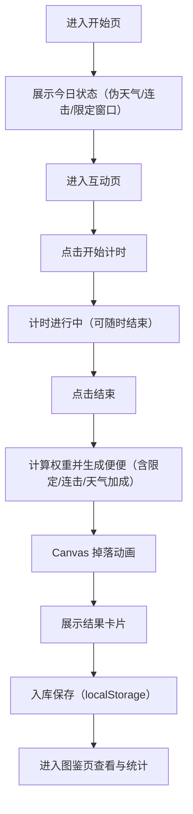

## 1. 产品概述
屎记（The Poo）是一款纯离线的 HTML5 Canvas 丑萌互动作品：点击开始计时、点击结束记时，按使用时长生成并掉落一坨"便便"，并进入图鉴收集。
- 目标用户：移动端用户、轻量休闲互动玩家、收藏向玩家
- 核心价值：低门槛打卡 + 收集图鉴 + 每日限定与连击奖励的长期动机

## 2. 核心功能

### 2.1 功能模块
1. **开始页**：作品标题、开始按钮、今日状态提示（伪天气/连击/每日限定窗口）
2. **互动页（Canvas 主舞台）**：开始/结束计时、掉落动画、生成结果展示、引导入库
3. **图鉴页**：已收集便便列表、稀有度与标签、统计信息、数据清空
4. **设置/说明弹层**：伪天气说明、隐私与离线说明、音效开关（可选）

### 2.2 页面详细说明
| 页面名称 | 模块名称 | 功能说明 |
|---|---|---|
| 开始页 | 今日状态卡片 | 展示"今日伪天气""连击天数""每日限定时间段"与触发提示 |
| 开始页 | 开始按钮 | 点击进入互动页并准备计时 |
| 互动页 | 计时控制 | 点击"开始"开始计时；点击"结束"停止计时并生成便便 |
| 互动页 | 掉落生成 | 按经历时间计算权重：种类、稀有度、掉落概率；触发每日限定/连击加成/伪天气加成 |
| 互动页 | 掉落动画 | 便便从顶部落下，软糯挤压弹性、落地轻微回弹与粒子（小星屑/小泡泡） |
| 互动页 | 结果卡片 | 显示生成时间、经历时间、便便名称、稀有度、标签、入库按钮 |
| 图鉴页 | 图鉴网格 | 按稀有度/类型分组或过滤；点击查看详情 |
| 图鉴页 | 统计信息 | 总收集数、稀有收集数、连续打卡天数、最近一次生成记录 |
| 图鉴页 | 数据管理 | 清空本地数据（需要二次确认） |
| 设置/说明 | 伪天气说明 | 纯离线：使用"本地日期种子"生成今日天气；不发起任何网络请求 |
| 设置/说明 | 音效开关 | 可选：本地开关并持久化到 localStorage |

## 3. 核心流程
### 3.1 用户主流程（文字）
用户进入开始页 → 查看今日状态 → 进入互动页 → 点击开始计时 → 任意时长后点击结束 → 生成并掉落便便 → 展示结果并入库 → 前往图鉴页查看收藏与统计 → 次日再来触发连击与每日限定。

### 3.2 流程图（Mermaid）

## 4. 交互与规则设计
### 4.1 计时规则
- 开始按钮触发 `startAt`；结束按钮触发 `endAt`
- 记录：
  - 生成时间：`endAt` 的本地时间字符串
  - 经历时间：`elapsedMs = endAt - startAt`，展示为 mm:ss.ms

### 4.2 便便生成规则（可调权重）
- 基础权重由经历时间决定：时间越长，越容易出更稀有/更大/更"滋润"的类型
- 稀有度层级：普通 / 稀有 / 史诗 / 传说 / 神秘（每日限定）
- 标签示例：干巴型、滋润型、泡泡型、彩糖型、双层夹心型、毛绒型（丑萌夸张但合规）
- 内容配置化：便便种类与掉落权重以"数据表"定义（后续可持续补充种类与素材，不改核心逻辑）

### 4.3 每日限定（神秘便便）
- 固定触发窗口：本地时间 00:00 - 00:10（可在设置页说明）
- 在窗口内结束计时且经历时间 ≥ 阈值时，触发"神秘便便"抽取池

### 4.4 伪天气联动
- 不联网：使用本地日期种子生成"今日天气状态"
- 天气状态：晴 / 雨 / 潮湿（湿度高）等
- 影响：雨/潮湿更易触发"滋润型"与"泡泡型"

### 4.5 连击奖励（连续多日打卡）
- 规则：每天首次"结束计时"视为一次打卡
- 连击天数越高：隐藏便便概率提升、稀有池权重提升

## 5. 用户界面设计
### 5.1 设计风格（丑萌软糯）
- 视觉关键词：软糯、挤压、果冻感、夸张描边、糖果色点缀、轻噪点纸感背景
- 主色：奶油米白 + 深咖描边
- 辅色：抹茶绿/蜜桃粉/柠檬黄作为稀有度高光与粒子
- 字体：优先使用系统内置中文字体栈（避免外部字体资源），标题做拟手写感（通过字重/描边/阴影实现）
- 动效：按钮轻微呼吸；掉落软弹；入库成功"咚"的缩放回弹

### 5.2 页面设计概览
| 页面名称 | 模块名称 | UI 元素 |
|---|---|---|
| 开始页 | 标题区 | 作品名、短标语、轻噪点背景与软糯装饰块 |
| 开始页 | 今日状态卡 | 图标 + 文案，展示伪天气/连击/限定窗口提示 |
| 互动页 | Canvas 舞台 | 全屏竖屏自适应，底部软垫"地面" |
| 互动页 | 操作条 | 大按钮：开始/结束；计时数字；避免遮挡舞台 |
| 互动页 | 结果卡片 | 稀有度徽章、名称、标签 chips、入库按钮 |
| 图鉴页 | 图鉴网格 | 卡片式列表、稀有度渐变描边、未获得为剪影 |
| 图鉴页 | 详情弹层 | 大图预览（Canvas 截图或重绘）、信息与首次获得时间 |

### 5.3 响应式与触控
- 屏幕方向：竖屏优先
- 无横向滚动条：容器 100vw，Canvas 按 DPR 缩放
- 触控：按钮尺寸 ≥ 44px，高对比状态、震动反馈可选（如支持则使用 `navigator.vibrate`，不影响离线）

## 6. 数据与合规
- 数据存储：localStorage（图鉴、统计、连击、设置）
- 纯离线：不使用 fetch/XMLHttpRequest/WebSocket/外部资源/CDN
- 合规：不含违法违规与不利于未成年内容；整体为夸张卡通化"便便拟物"收集，不出现低俗露骨表现

## 7. 内容扩展与素材接入（后续迭代）
- 初版默认"程序绘制"：使用 Canvas 形状绘制与少量粒子，保证体积与离线兼容
- 后续可扩展本地素材：
  - 图片：放入 `images/`，以相对路径加载（如图鉴缩略图、限定款贴纸）
  - 音频：放入 `audio/`，使用 `<audio>` 或 WebAudio 播放（同样不联网）
- 体积约束：整体 zip < 8MB，素材需压缩（优先 WebP/OGG，或减少帧/时长）
