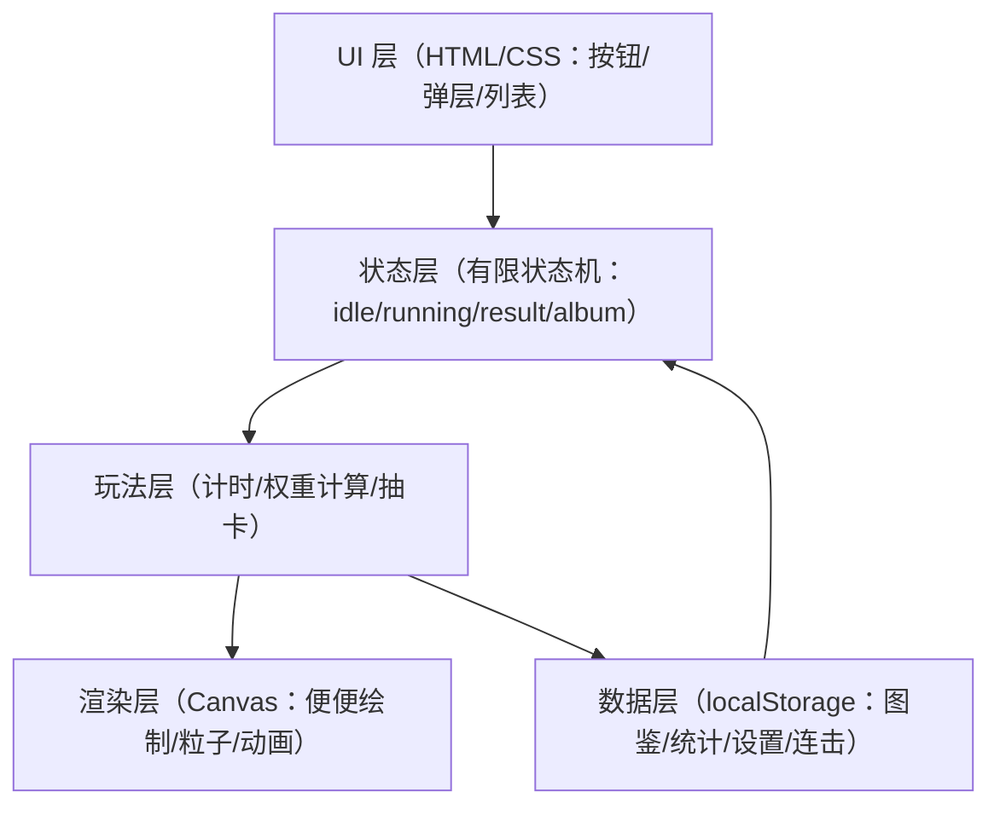
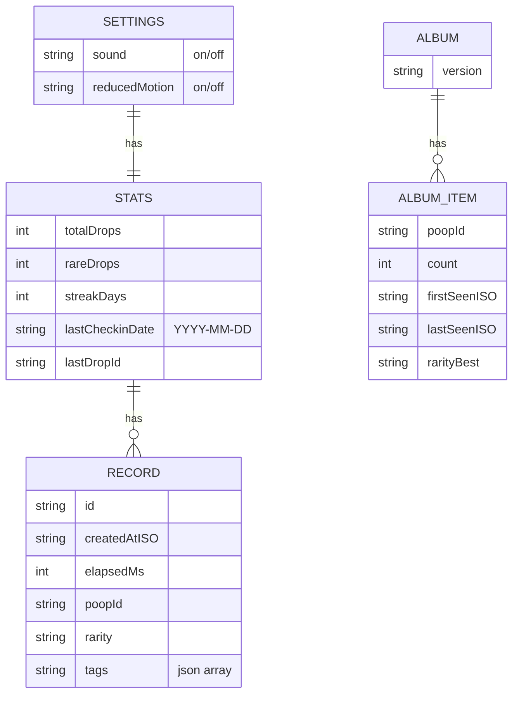

## 1. 架构设计
纯前端、纯离线、无任何网络通信。以单页应用形态组织，核心为 Canvas 渲染循环 + 本地状态机。

## 2. 技术说明
- 前端：Vanilla HTML + CSS + JavaScript（无框架，降低体积与离线复杂度）
- 渲染：HTML5 Canvas 2D（按设备 DPR 适配，保持清晰）
- 数据持久化：localStorage（JSON 序列化）
- 时间：Date + performance.now（计时精度与展示）
- 兼容：移动端 Safari/Chrome；避免使用必须权限的 API

## 3. 路由定义
单页面内通过 UI 状态切换，不使用真实路由与跳转。
| 视图标识 | 用途 |
|---|---|
| home | 标题/开始入口/今日状态 |
| play | Canvas 舞台 + 开始/结束 |
| result | 结果卡片 + 入库 |
| album | 图鉴网格 + 统计 |
| modal | 设置/说明/详情弹层（叠加） |

## 4. 关键模块设计
| 模块 | 职责 |
|---|---|
| timer | 开始/结束计时、格式化展示 |
| rng | 可复现随机：基于日期种子 + 轻量 PRNG |
| weather | 伪天气生成（今日固定），提供概率加成参数 |
| streak | 连击计算（按本地日期的首次结束计时作为打卡） |
| poopCatalog | 便便种类"数据表"（id/名称/稀有度/标签/权重/可选素材引用），支持后续持续补充 |
| gacha | 便便池定义与权重抽取，输出生成结果对象 |
| renderer | 便便形状绘制、挤压弹性、掉落与落地效果、粒子 |
| albumStore | 图鉴读写、去重/计数、统计更新 |
| errorOverlay | try-catch 捕获错误后展示友好提示「哎呀，出错了，请重启试试吧~」 |

## 5. 数据模型
### 5.1 数据模型定义（Mermaid ER）

### 5.2 localStorage 键约定
| Key | 内容 |
|---|---|
| thepoo_album_v1 | 图鉴与 item 统计 |
| thepoo_stats_v1 | 总次数/连击/最近记录 |
| thepoo_settings_v1 | 音效/动效偏好等 |
| thepoo_today_v1 | 今日伪天气与种子缓存（可选） |

## 6. 性能与体积预算
- 目标：zip < 8MB（优先单文件/极少图片与音频）
- Canvas：仅一张主画布；粒子数量上限；隐藏页暂停渲染（Page Visibility）
- 事件：使用被动监听（touchmove 等尽量避免），减少 layout thrash

## 6.1 本地素材组织（可选）
- 初版可全部程序绘制，不依赖任何外部图片/字体/CDN
- 若后续补充素材：
  - `images/`：WebP/PNG 小图（图鉴缩略图、限定贴纸），通过相对路径加载
  - `audio/`：短音效（OGG/MP3），本地播放并提供开关
- 所有引用必须是相对路径，且不得出现任何网络请求与外部跳转

## 7. 安全与合规
- 不发起任何网络请求；不引入外部资源；不进行外部跳转
- 仅使用本地存储保存游戏数据，不收集用户隐私信息
